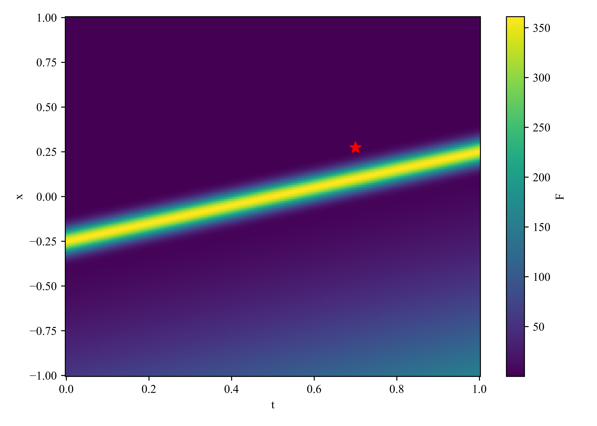
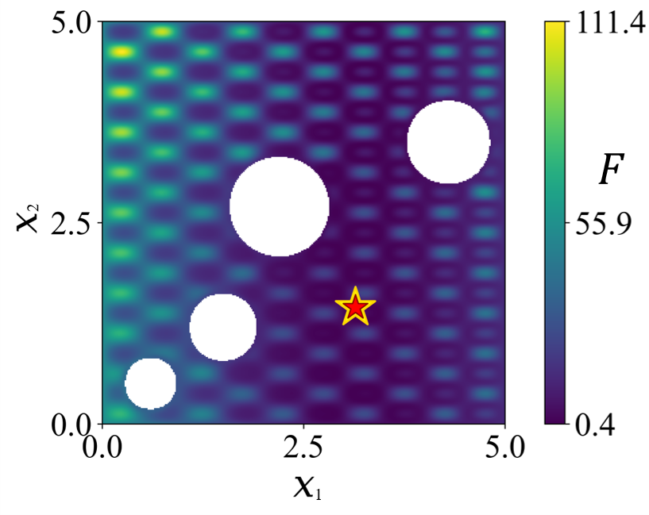

# Benchmarking and Performance Evaluation for Physics-Informed Evolutionary Optimization

This repository provides a benchmark suite for studying **surrogate-assisted
optimization with PDE-dependent objectives and constraints**. It contains eleven
test problems, F1–F11, together with multiple surrogate models, optimizers,
constraint-handling strategies, reference-solution calculations and experiment
reproduction scripts.

In this work, we focus on a surrogate-assisted form of physics-informed
evolutionary optimization, where physics is primarily incorporated into surrogate
modeling to support the evolutionary search for expensive constrained optimization
problems (ECOPs) with PDE-based constraints. The eleven benchmark problems combine
PDE states with algebraic objectives and constraints, spanning PDE dynamics,
landscape characteristics, state–decision coupling, and feasible-region geometry.

[Benchmark design](#benchmark-design) · [Test suite](#test-suite-f1f11) ·
[Full problem definitions](docs/problem_definitions.md) · [Evaluation](#models-optimizers-and-evaluation) ·
[Quick start](#quick-start)

## Benchmark design

The benchmark aims to extract and systematically control the key factors that
determine optimization difficulty in ECOPs with PDE-based constraints. Such an
abstraction enables reproducible evaluation and facilitates the analysis of how
different physical and optimization factors affect algorithmic performance.

The benchmark test functions are characterized along four complementary axes,
which represent different sources of complexity arising from PDE-based
constraints, algebraic objective landscapes, and their interactions:

- **Type of PDE dynamics:** diffusion, reaction–diffusion, convection–diffusion,
  wave propagation, elliptic equilibrium, and high-order nonlinear dissipation.
- **Type of algebraic functions:** quadratic, fractional oscillatory, Rastrigin,
  six-hump camel, Branin, Goldstein–Price, Rosenbrock, and Ackley landscapes.
- **State–decision coupling mode:** fixed PDE fields in F1–F8 and parameter-dependent
  fields with integral objectives in F9–F11.
- **Feasible-region geometry:** no additional algebraic constraints, inequalities,
  equality manifolds, and geometric restrictions.


*Manuscript illustration of a PDE state surface combined with different algebraic
and geometric constraints.*

The [benchmark design document](docs/benchmark_design.md) gives the unified
mathematical formulation and the manuscript's detailed explanation of these axes.

## Test suite: F1–F11

| Problem | PDE model | Decision variables | Objective / constraints | Main feature | HF budget |
| --- | --- | --- | --- | --- | ---: |
| [F1](docs/problem_definitions.md#f1) | Viscous Burgers equation | `(x, t)` | Sinusoidal fractional objective; two inequalities | Nonlinear dynamics and constrained search | 40 |
| [F2](docs/problem_definitions.md#f2) | Wave equation | `(x, t, z)` | Quadratic objective; two equality tolerance bands | Extra algebraic variable and second-order time derivative | 60 |
| [F3](docs/problem_definitions.md#f3) | Allen–Cahn-type reaction–diffusion equation | `(x, t)` | Rastrigin-type objective | Multimodal objective coupled to a nonlinear field | 40 |
| [F4](docs/problem_definitions.md#f4) | Forced heat equation | `(x, t)` | Six-hump camel objective | Spatially segmented, time-dependent forcing | 40 |
| [F5](docs/problem_definitions.md#f5) | Forced heat equation | `(x, t)` | Linear objective in transformed coordinates; polynomial inequalities | Nonlinear algebraic feasibility | 40 |
| [F6](docs/problem_definitions.md#f6) | Convection–diffusion equation with a manufactured solution | `(x, t)` | Right-side 5% response objective | Local packet-tail accuracy important to optimization | 70 |
| [F7](docs/problem_definitions.md#f7) | Steady Poisson equation | `(x1, x2)` | Branin-type objective; perforated spatial domain | Irregular geometry and boundary conditions | 60 |
| [F8](docs/problem_definitions.md#f8) | Kuramoto–Sivashinsky equation | `(x, t)` | Quadratic objective; equality tolerance band | Fourth-order spatial derivatives | 145 |
| [F9](docs/problem_definitions.md#f9) | Parametric reaction–diffusion equation | `(x, t, mu)` | Goldstein–Price-type objective using local state and a state integral | Parameter-dependent state and integral coupling | 40 |
| [F10](docs/problem_definitions.md#f10) | Parametric Burgers equation | `(x, t, lognu)` | Shifted Rosenbrock objective using state and dissipation | Viscosity-dependent dynamics and derivative-based integral | 40 |
| [F11](docs/problem_definitions.md#f11) | Parametric forced heat equation | `(x, t, mu)` | Ackley-type objective using state and input work | Parameterized forcing and state–source integral | 40 |

The HF budgets above come from [the main configuration](protocols/main.yaml).
**All F1–F11 objective functions, PDEs, initial/boundary conditions, constraints
and reference-solution calculations are collected in the
[full problem definitions document](docs/problem_definitions.md).**

The current F6 objective targets the packet's right-side 5% response. Its
continuous reference point is `(0.1 + 0.1 sqrt(log(20)), 0.7)` with objective
zero. The PDE, stored field and solver grid are unchanged.

| Problem | Initial labels | Population | Generations | Update interval | Labels per update | Total HF labels |
| --- | ---: | ---: | ---: | ---: | ---: | ---: |
| F6 | 20 | 100 | 100 | 10 | 5 | 70 |
| F8 | 100 | 100 | 150 | 10 | 3 | 145 |

For F8, GP uses a Matérn 3/2 kernel with length-scale bounds `[0.1, 100]`
and no mean centering; PIGP uses bounds `[0.01, 100]` and no mean centering.
PINN/PINO use 300 training steps per fit; MLP uses 500. Their data/residual
weights, learning rates and boundary-loss settings are fixed in
[the main configuration](protocols/main.yaml). F8 state queries use periodic
spatial interpolation. The two self-managed baselines retain their own
initial sampling and search rules under the same total HF budget.

### Visual examples

These figures show two contrasting problem landscapes. Variable labels and
representative reference markers follow the manuscript. Numerical definitions
and verification scope are given in the full problem definitions.

| F6: localized objective valley | F7: perforated spatial domain |
| --- | --- |
|  |  |

The [problem gallery](docs/problem_gallery.md) includes objective maps,
state-surface views and parameter slices for all eleven problems.

## Models, optimizers and evaluation

The suite includes data-driven and physics-informed surrogate models, multiple
optimizers and several constraint-handling strategies. These components share
problem interfaces and configurable sampling budgets. Model definitions,
method identifiers and literature attributions are provided in
[the method documentation](methods/README.md).

Evaluation separates three questions:

1. **Optimization quality:** what is the best feasible true objective among the
   points for which the algorithm actually obtained reference information?
2. **Feasibility and repeatability:** how often are feasible solutions found,
   and how do objective values vary across independent runs?
3. **State approximation and physics:** how accurately does the surrogate
   approximate the field, and what PDE and initial/boundary-condition residuals
   does it produce on specified evaluation points?

The main experimental comparisons use 30 runs per problem–method pair with
seeds 450–479. Result summaries report feasible-run counts and the mean and
standard deviation of feasible objectives (`ddof=0`). Convergence trajectories
use the consumed HF archive. Surrogate predictions and unconsumed
final-population diagnostics do not determine the reported best objective.

Feasibility uses a constraint-violation threshold of `1e-4`, in addition to the
problem-specific equality bands in F2 and F8. PDE residuals and field errors are
reported at stated evaluation resolutions. These measures describe different
aspects of a method and are evaluated separately.

The configured HF budget counts **oracle state-label requests**. Reference
fields are generated separately, and state queries use their interpolators.
Diagnostic evaluations and auxiliary reference quadrature are outside this
label counter. See [the evaluation conventions](methods/README.md#budget-and-reporting)
for the exact accounting and integral-objective behavior.

## Reference solutions and reproducibility

Each problem has a matching reference entry point, `reference/f01.py` through
`reference/f11.py`, and a target record under `reference/targets/`. Depending on
the problem, verification uses algebraic stationary or KKT equations, analytic
bounds, a manufactured solution, or numerical root finding on the stored field
with independent interpolation and quadrature checks.

PDE accuracy, algebraic optimality and attainment of a target in the implemented
discrete problem are checked separately. Numerical root precision alone does
not certify global optimality. The individual reports describe their scope,
including the distinction between continuous and discrete integral objectives.
See [reference solutions](reference/README.md) for the per-problem commands.

### Reference PDE solvers and stored grids

We use the following methods to compute the reference PDE fields for F1–F11.
The stored grids give the dimensions of the archived state arrays.

| Problem | Computation | Stored grid |
| --- | --- | --- |
| F1 | Centered spatial differences, forward Euler | 6001 × 80001 |
| F2 | Centered wave scheme, CFL number 1 | 16001 × 6401 |
| F3 | Centered spatial differences, forward Euler | 20001 × 20001 |
| F4 | Centered spatial differences, forward Euler | 1201 × 640001 |
| F5 | Centered spatial differences, forward Euler | 1001 × 50001 |
| F6 | Evaluation of the prescribed solution | 24553 × 9601 |
| F7 | Nine-point Poisson stencil, conjugate gradient | 1000 × 1000 |
| F8 | Periodic spatial differences, fourth-order Runge–Kutta | 200 × 10001 |
| F9 | Split reaction steps and FFT diffusion | 500 × 2001 × 1000 |
| F10 | Rusanov flux/RK2 and sine-transform diffusion | 1000 × 2001 × 1000 |
| F11 | Split source steps and FFT diffusion | 500 × 2001 × 1000 |

For F7, both grid axes are spatial. For F9–F11, the third axis indexes the
parameter values. Stored time grids may be subsampled from the internal solver
grids. The corresponding implementations are
[`dataset/generate_f01.py`](dataset/generate_f01.py) through
[`dataset/generate_f11.py`](dataset/generate_f11.py).

The included archived-run indexes refer to the preceding experiment version;
see [reproduction versioning](reproduction/README.md#archive-version) before
using them for F6 or F8.

The [reproduction scripts](reproduction/README.md) reconstruct objective tables,
convergence figures and residual summaries from archived runs, and evaluate
saved surrogate models. Input fingerprints identify the data and artifacts used.
Large reference fields and archived experiment outputs are not included in this
repository; the data manifest specifies the required reference files.

## Quick start

Use Python 3.11 and run commands from the repository root:

```bash
python -m pip install -r requirements-analysis.txt
python examples/demo_f06.py --out outputs/demo_f06
```

The demo generates a small F6 field, trains a surrogate and runs optimization
with 12 HF queries. It checks installation with a smaller grid and budget than
the main experiment configuration.

Import the reference fields using [the data instructions](dataset/README.md),
then run experiments:

```bash
python experiments/run.py --problem f06 --method gp_de --protocol main --seed 450
python experiments/batch.py --protocol main --runs 30 --dry-run
python experiments/aggregate.py --protocol main
```

The batch command previews the jobs; remove `--dry-run` to execute them.
Reference-value checks can be run independently:

```bash
python reference/f06.py --output outputs/f06_reference.json
python reference/f01.py --output outputs/f01_reference.json
```

## Repository layout

| Directory | Contents |
| --- | --- |
| `problems/` | F1–F11 PDEs, objectives and constraints |
| `dataset/` | Reference-field generation, import and validation |
| `surrogates/` | Data-driven and physics-informed surrogate models |
| `optimizers/`, `methods/` | Search algorithms and surrogate-assisted methods |
| `protocols/` | Main experiment and demonstration configurations |
| `experiments/` | Run, batch and aggregate commands |
| `core/` | Experiment execution and component registry |
| `evaluation/` | Reference interpolation, HF-query accounting and numerical metrics |
| `reference/` | One reference-solution entry point per problem |
| `reproduction/` | Archived-result reconstruction and saved-model evaluation |
| `examples/` | Small installation demo |
| `docs/` | Manuscript-based benchmark design, full F1–F11 definitions and illustrated gallery |

Problem IDs are consistent throughout: `problems/f06.py`, `reference/f06.py`,
`reference/targets/f06.json`, `dataset/generate_f06.py` and `dataset/f06.npz`
all refer to F6. Python filenames use lowercase words and underscores.

[MIT License](LICENSE). Method-specific literature attributions are listed in
[the method documentation](methods/README.md#literature-baseline-attribution).
