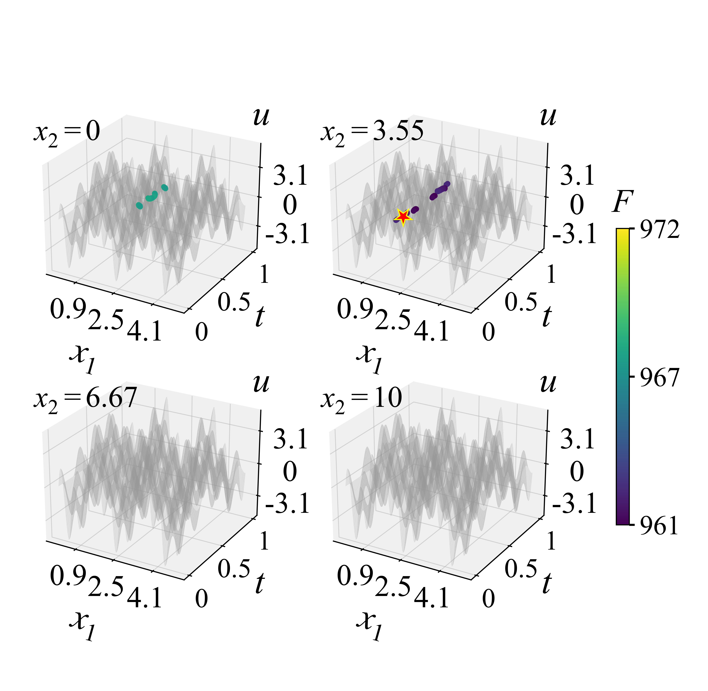
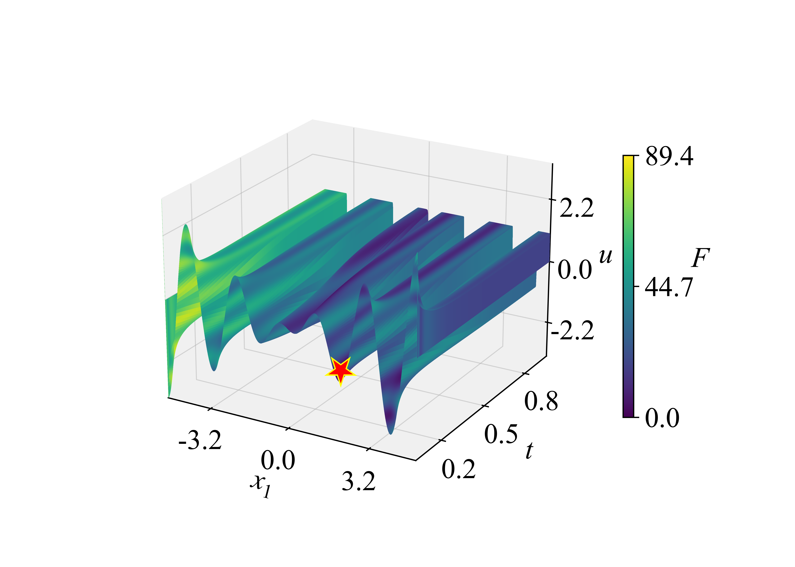
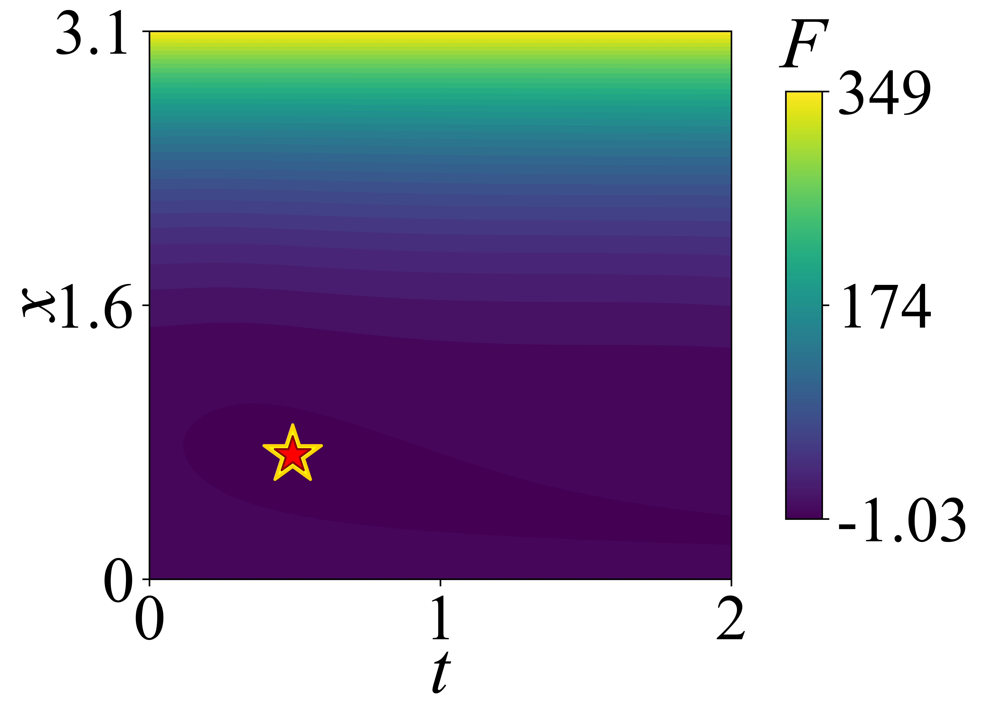
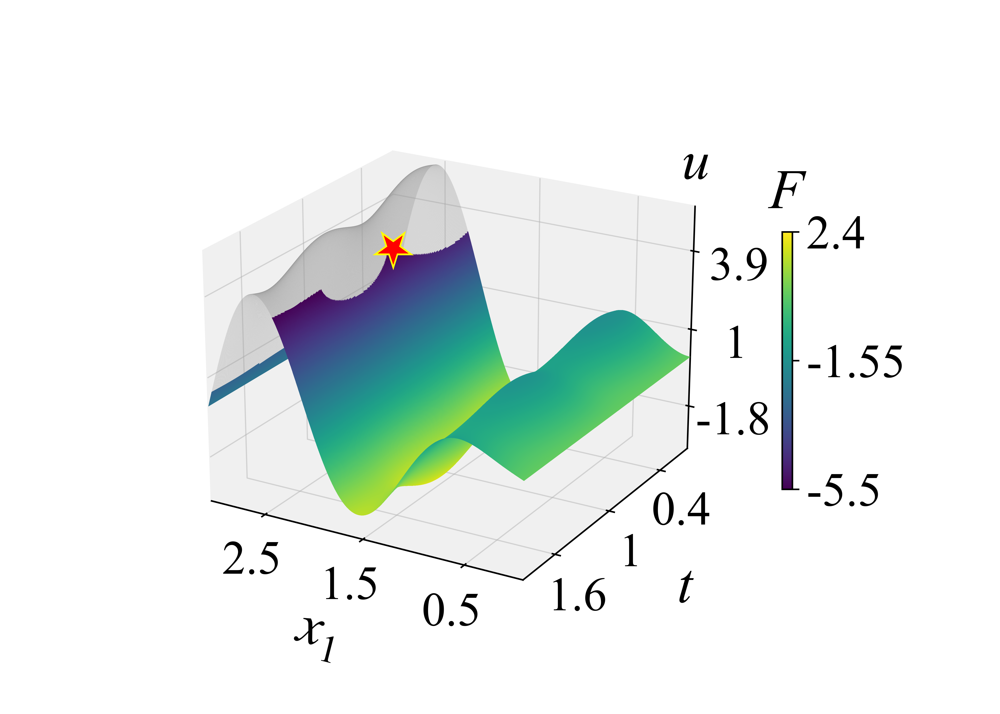
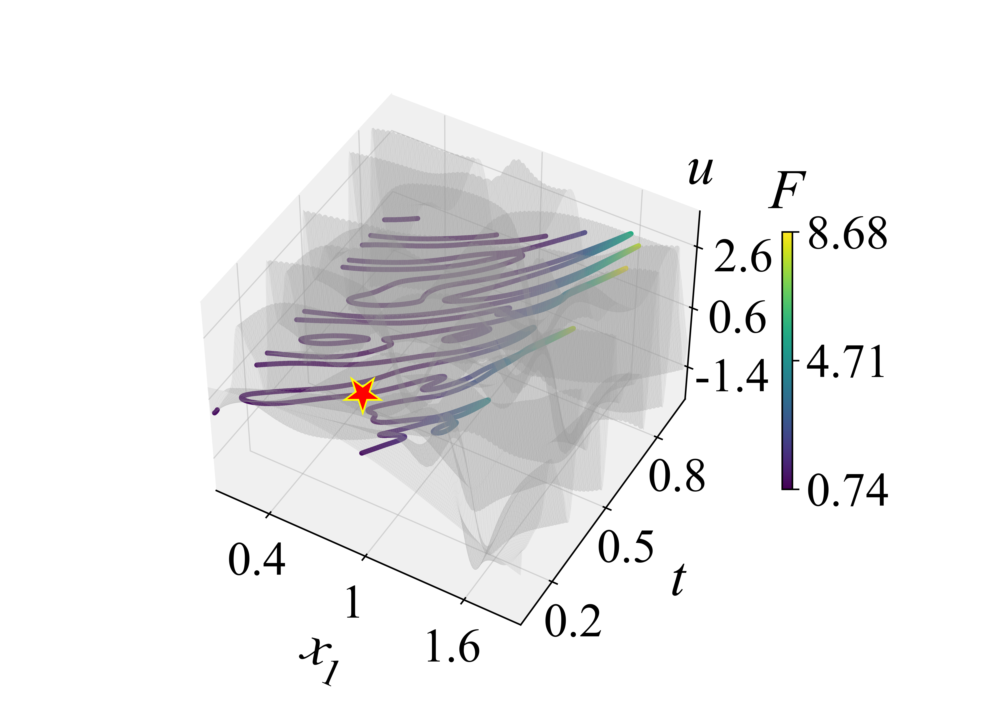
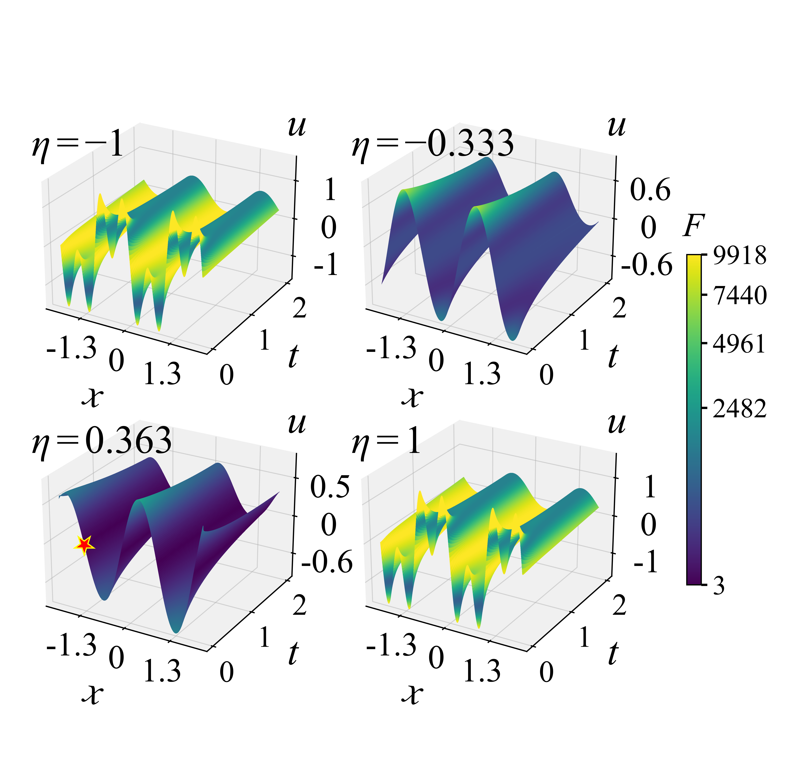
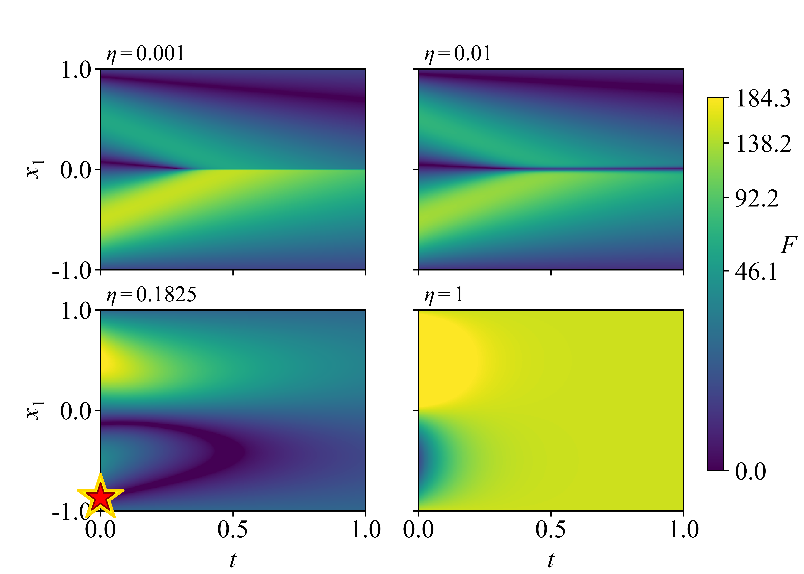
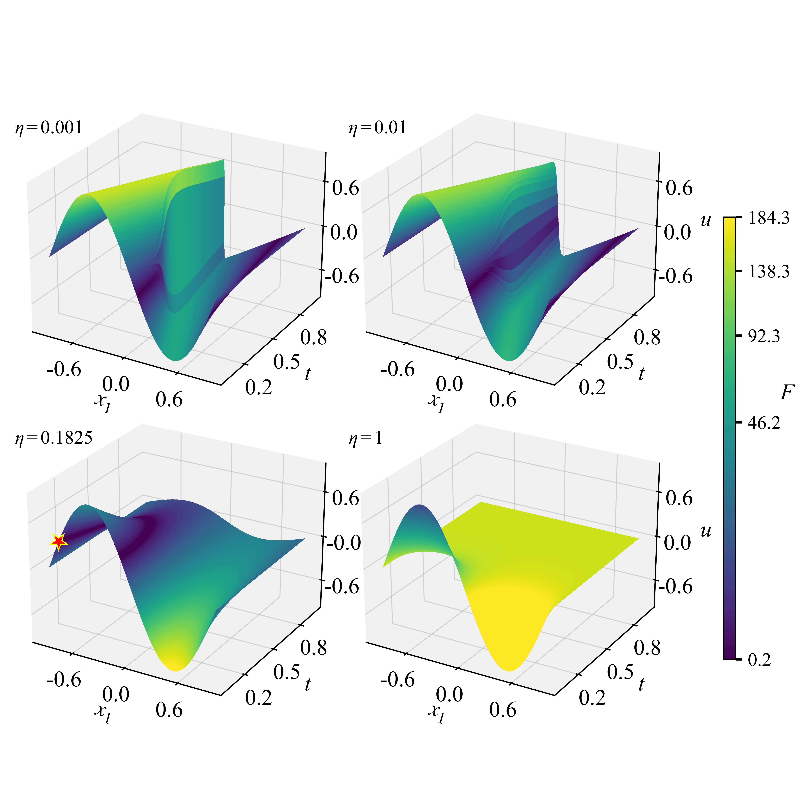

# Problem definitions and reference solutions: F1–F11

[Benchmark overview](../README.md) · [Benchmark design](benchmark_design.md) · [Problem gallery](problem_gallery.md)

[F1](#f1) | [F2](#f2) | [F3](#f3) | [F4](#f4) | [F5](#f5) | [F6](#f6) | [F7](#f7) | [F8](#f8) | [F9](#f9) | [F10](#f10) | [F11](#f11)

The following sections present the manuscript's problem descriptions, PDEs,
initial/boundary conditions, objectives, constraints and reference solutions.
Implementation conventions are stated separately within each problem.

**Figure version:** F6 objective panels updated on 8 October 2026; the other
figures were updated on 29 September 2026 using the stored reference
fields. Variable labels and representative reference markers follow the
manuscript. The [problem gallery](problem_gallery.md) describes plotting
conventions, including F2's state-surface display band. The definitions and
reference calculations state the numerical formulation and verification scope.

## F1

**Burgers equation with a sinusoidal fractional objective**

$F_1$ combines a highly nonlinear sinusoidal fractional objective function with the viscous Burgers equation. The nonlinear convection-diffusion dynamics introduce shock-induced ridges and narrow feasible corridors. The figures below illustrate the problem.

| Objective landscape / decision-space slices | PDE state surface colored by objective |
| --- | --- |
|  |  |

### Problem definition

The decision vector is $(x,t)\in[-1,1]\times[0,1]$. The state $u=u(x,t)$ is determined by the PDE; it is not an independent optimization variable. The formulation is

$$
\min_{x,t}\quad F_1(x,t,u)
=-\frac{\sin^3\!\left(6\pi(x+1)\right)\sin\!\left(6\pi(2-u)\right)}{27(x+1)^3(3x-3u+9)},
$$

subject to

$$
\begin{aligned}
u_t+u\,u_x&=\frac{0.01}{\pi}u_{xx},\\
u(x,0)&=-\sin(\pi x),\\
u(-1,t)&=u(1,t)=0,\\
g_1(x,u)&=9(x+1)^2+3u-5\leq0,\\
g_2(x,u)&=1-3(x+1)+(3u-2)^2\leq0.
\end{aligned}
$$

The implementation uses the equivalent transformed coordinates $a=3(x+1)$ and $b=3(2-u)$:

$$
f(a,b)=-\frac{\sin^3(2\pi a)\sin(2\pi b)}{a^3(a+b)},
\qquad g_1=a^2-b+1,\qquad g_2=1-a+(b-4)^2.
$$

### Implementation conventions

For objective evaluation only, $a$ is replaced by $\max(a,10^{-10})$ to avoid division by zero at $x=-1$. The constraints use the unclamped transformation. Aggregate violation is

$$
\mathrm{CV}=\max(0,g_1)+\max(0,g_2).
$$

The evaluation protocol classifies a decision as feasible when $\mathrm{CV}\leq10^{-4}$; no separate positive tolerance is assigned to either inequality.

### PDE reference field

The data generator uses forward Euler in time and centered differences for both spatial derivatives. The stored grid contains $6001\times80001$ points, with $\Delta x=2/6000$ and $\Delta t=1.25\times10^{-5}$. Endpoint values remain zero. The resulting `f01.npz` contains the arrays `x`, `t`, and `u`, with $u$ indexed by space and time. The evaluation interface uses linear interpolation on this grid.

The PDE reference is numerical. Refining the algebraic optimum to many digits does not establish the same accuracy for this discretized field or its interpolated values.

### Reference value and verification

With $a=3(x+1)$ and $b=3(2-u)$, both inequalities are inactive at the reference point, so the stationary equations are

$$
6\pi\cot(2\pi a)-\frac{3}{a}-\frac{1}{a+b}=0,
\qquad
2\pi\cot(2\pi b)-\frac{1}{a+b}=0.
$$

Solving these equations near $(a,b)=(1.228,4.245)$ gives

$$
\begin{aligned}
a^\star&\approx1.2279713527638443,&
b^\star&\approx4.2453733664584182,\\
x^\star&\approx-0.5906762157453852,&
u^\star&\approx0.5848755445138606,\\
F_1^\star&\approx-0.09582504141803582.
\end{aligned}
$$

The recorded state-matching example is $t\approx0.3575100930150587$. The reference script uses 70-digit arithmetic and a root tolerance of $10^{-60}$, reports stationarity residuals, and checks the two inequalities. This verifies the algebraic stationary point; the script does not independently establish its global optimality or its attainment on a particular PDE dataset. State attainment requires checking $u(x^\star,t)=u^\star$ on that dataset, with discretization and interpolation errors reported separately.

### Files

- [Problem implementation](../problems/f01.py)
- [PDE data generator](../dataset/generate_f01.py)
- [Reference stationary-point calculation](../reference/f01.py)
- [Reference target and state-matching example](../reference/targets/f01.json)

From the repository root, run `python reference/f01.py` to reproduce the algebraic calculation.

## F2

**Wave equation with quadratic objective and equality constraints**

$F_2$ embeds the wave equation into a quadratic function, introducing a three-dimensional decision space together with two nonlinear equality constraints. The feasible region is confined to a low-dimensional manifold, and even small surrogate modeling errors can cause substantial constraint violations. The wave-induced state coupling distorts the original quadratic landscape and introduces anisotropic sensitivity across decision dimensions. The figures below illustrate the problem.

| Objective landscape / decision-space slices | PDE state surface colored by objective |
| --- | --- |
|  |  |

### Problem definition

The manuscript uses $(x_1,x_2,t)$, where $x_1\in[0,5]$, $x_2\in[0,10]$, and $t\in[0,1]$. The state is $u=u(x_1,t)$, and the objective is

$$
\min_{x_1,x_2,t}\quad
F_2=1000-4x_1^2-2u^2-x_2^2-2x_1u-2x_1x_2,
$$

subject to

$$
\begin{aligned}
u_{tt}-4u_{x_1x_1}&=0,\\
u(x_1,0)&=-2.5\sin(\pi x_1)+2.6\sin(4\pi x_1),\\
u_t(x_1,0)&=0,\\
u(0,t)&=u(5,t)=0,\\
h_1&=4x_1^2+u^2+x_2^2-25=0,\\
h_2&=16x_1+14u+7x_2-56=0.
\end{aligned}
$$

For numerical evaluation, both equality constraints use $\varepsilon_{\mathrm{eq}}=0.1$, i.e., $|h_1|\leq0.1$ and $|h_2|\leq0.1$.

### Implementation conventions

The code orders the decision as `(x, t, z)`, corresponding to $(x_1,t,x_2)$. Only `(x, t)` is sent to the PDE state provider. The auxiliary variable `z` enters the algebraic objective and constraints; it is not a PDE coordinate or a parameter of the wave equation.

With $a=2x_1$, $b=u$, and $c=x_2$, the objective becomes $f=1000-a^2-2b^2-c^2-ab-ac$. The implemented violation is

$$
\mathrm{CV}=\max(0,|h_1|-0.1)+\max(0,|h_2|-0.1).
$$

The common feasibility threshold is $\mathrm{CV}\leq10^{-4}$, applied after these two equality bands. The reference value below is for the exact equalities, not the minimum over the wider tolerance bands.

### PDE reference field

The wave speed is $c_{\mathrm{wave}}=2$. The initial displacement is a sum of two sine modes, giving the analytic solution

$$
u(x_1,t)=-2.5\sin(\pi x_1)\cos(2\pi t)
+2.6\sin(4\pi x_1)\cos(8\pi t).
$$

Substitution verifies the PDE, the initial displacement, zero initial velocity, and both fixed endpoint values. The supplied generator nevertheless produces a numerical reference array using a centered leapfrog scheme at CFL number 1. Its default refinement is 16, giving $16001\times6401$ stored points, $\Delta x=0.005/16$, and $\Delta t=\Delta x/2$. The first time level uses a fourth-order Taylor expansion with analytic initial spatial derivatives. A d'Alembert solution with an odd periodic extension supplies a maximum relative-error self-check. This check measures the generated field; finite startup error, floating-point error, and off-grid interpolation remain distinct from the exact modal formula.

The generated `f02.npz` stores `x`, `t`, and `u`. Experiment evaluations linearly interpolate the stored grid.

### Reference value and verification

For the exact equalities $h_1=a^2+b^2+c^2-25=0$ and $h_2=8a+14b+7c-56=0$, stationarity of $L=f+\lambda h_1+\mu h_2$ yields

$$
\begin{aligned}
-2a-b-c+2\lambda a+8\mu&=0,\\
-4b-a+2\lambda b+14\mu&=0,\\
-2c-a+2\lambda c+7\mu&=0,\\
h_1=h_2&=0.
\end{aligned}
$$

The intersection of the sphere and plane is parameterized by an angle. A search on this circle supplies an initial point for the KKT solve. The bundled script refines the KKT root using 70-digit arithmetic and tolerance $10^{-60}$, obtaining

$$
\begin{aligned}
x_1^\star&\approx1.7560606709373599,\\
x_2^\star&\approx3.5521711548270170,\\
u^\star&\approx0.2169879415152230,\\
F_2^\star&\approx961.7151721300522.
\end{aligned}
$$

Recorded state-matching examples are $t\approx0.2174461450691052$ and $t\approx0.7825538549585337$. The executable check reports KKT and equality residuals; it does not reproduce a global search over the circle, certify the tolerance-band optimum, or check PDE-field attainment. Those are separate verification tasks. The high working precision describes the algebraic calculation, not the accuracy of interpolated field values.

### Files

- [Problem implementation](../problems/f02.py)
- [PDE data generator and analytic field self-check](../dataset/generate_f02.py)
- [Reference KKT calculation](../reference/f02.py)
- [Reference target and state-matching examples](../reference/targets/f02.json)

From the repository root, run `python reference/f02.py` to reproduce the algebraic calculation.

## F3

**Reaction-diffusion equation with a shifted Rastrigin objective**

$F_3$ embeds a nonlinear reaction-diffusion PDE into a shifted Rastrigin function. The cubic term $(5u^3-5u)$ induces sharp transitions and strong sensitivity, so small changes in $\boldsymbol{x}$ lead to abrupt variations in the objective function, amplifying the multimodal landscape. The figures below illustrate the problem.

| Objective landscape / decision-space slices | PDE state surface colored by objective |
| --- | --- |
|  |  |

### Problem definition

The manuscript defines the following family:

$$
\min_{\boldsymbol{x},t}\quad
F_3(\boldsymbol{z})=\sum_{i=1}^{D+1}\left(z_i^2-10\cos(2\pi z_i)+10\right),
$$

with

$$
\begin{aligned}
\boldsymbol{x}&\in[-5,5]^D,\qquad t\in[0,1],\\
\boldsymbol{z}&=[x_1-1.9004,\ u+1.153,\ x_2,\ldots,x_D]^\top,\\
u_t-10^{-4}u_{x_1x_1}+5u^3-5u&=0,\\
u(x_1,0)&=-(2.15/\pi)x_1\cos(\pi x_1),\\
u(-5,t)&=u(5,t)=0,\qquad t>0.
\end{aligned}
$$

Here $u=u(x_1,t)$ is determined by the PDE. There are no additional algebraic constraints.

### Implementation conventions

The public implementation is the $D=1$ instance, with decision and query vector $(x,t)\in[-5,5]\times[0,1]$ and

$$
F_3= (x-1.9004)^2-10\cos\!\left(2\pi(x-1.9004)\right)+10
+(u+1.153)^2-10\cos\!\left(2\pi(u+1.153)\right)+10.
$$

It has no configurable higher-dimensional decision vector. Aggregate algebraic violation is identically zero, so the common $10^{-4}$ feasibility threshold imposes no additional algebraic restriction.

The manuscript specifies zero Dirichlet endpoints for $t>0$. The public physics interface instead supplies endpoint state equality $u(-5,t)=u(5,t)$, without fixing their common value. The data generator has a distinct convention: it copies the right endpoint and penultimate node into the left endpoint and second node at initialization; for later time levels it keeps both endpoints zero and copies the penultimate node into the second node after each update. These assignments must be retained to reproduce its stored field. They are not a conventional periodic stencil, and the initial formula has unequal nonzero endpoint values. Boundary consistency should therefore be checked separately from objective attainment.

### PDE reference field

The generator uses forward Euler with centered second spatial differences, $\Delta x=5\times10^{-4}$, and $\Delta t=5\times10^{-5}$. The stored field has $20001\times20001$ points on $[-5,5]\times[0,1]$. Its reaction term is $-5u^3+5u$, and the diffusivity is $10^{-4}$. The `f03.npz` arrays are `x`, `t`, and `u`; the evaluation interface uses linear grid interpolation.

This field is numerical. The boundary and initial-node conventions above are part of its reproducible definition, and the grid resolution alone is not an error bound.

### Reference value and verification

Each shifted Rastrigin term has the form

$$
r^2+10[1-\cos(2\pi r)]\geq0.
$$

Thus the algebraic lower bound is $F_3^\star=0$, attained when $x=1.9004$ and $u=-1.153$ in the public $D=1$ instance. For the manuscript's general family, the remaining spatial coordinates also equal zero. The recorded state-matching example is

$$
(x,t)\approx(1.9004,\ 0.03362608190173166),\qquad u^\star=-1.153.
$$

The reference script substitutes the target into the implemented objective. With `--data-dir`, it also evaluates the recorded decision on the supplied `f03.npz` and reports the state error. Without a dataset, the script verifies the algebraic target only. Attainment of the zero lower bound by the PDE-reduced problem depends on reaching the required state; checking one recorded decision numerically is subject to interpolation and field errors.

### Files

- [Problem implementation and physics boundary condition](../problems/f03.py)
- [PDE data generator and endpoint assignments](../dataset/generate_f03.py)
- [Reference target and optional field check](../reference/f03.py)
- [Reference target record](../reference/targets/f03.json)

From the repository root, run `python reference/f03.py` for algebraic substitution, or `python reference/f03.py --data-dir dataset` when the reference data are installed.

## F4

**Distributed-source heat equation with a six-hump camel objective**

$F_4$ considers a control-driven reaction-diffusion PDE with spatially distributed feedback $\boldsymbol{T}(t)$. High-order polynomial terms in $(u-1)$ induce strong nonconvexity. The coupling between $x$ and $u$ further shapes a curved valley with steep walls. The figures below illustrate the problem.

| Objective landscape / decision-space slices | PDE state surface colored by objective |
| --- | --- |
|  |  |

### Problem definition

The decision vector is $(x,t)\in[0,\pi]\times[0,2]$. The state $u=u(x,t)$ is determined by

$$
\begin{aligned}
u_t&=u_{xx}+\beta_u[\boldsymbol{b}^{\top}(x)\boldsymbol{T}(t)-u],\\
u(0,t)&=u(\pi,t)=0,\\
u(x,0)&=0,
\end{aligned}
\qquad \beta_u=1.5.
$$

The objective is

$$
\min_{x,t}\quad F_4(x,t,u)
=4(u-1)^2-2.1(u-1)^4+\frac13(u-1)^6
+x(u-1)-4x^2+4x^4.
$$

The four spatially distributed control signals are

$$
T_i(t)=1.1+5\sin(t/4+i/10),\qquad i=1,\ldots,4.
$$

The function $b_i(x)$ is the indicator of $[(i-1)\pi/4,i\pi/4)$, including the right endpoint in the last interval. Thus the forcing has four spatial segments. The prescribed signals $\boldsymbol{T}(t)$ are fixed functions; the optimizer does not vary them. There are no additional algebraic constraints.

### Implementation conventions

The code uses $a=x$ and $b=u-1$, giving the six-hump camel polynomial

$$
f(a,b)=4b^2-2.1b^4+\frac13b^6+ab-4a^2+4a^4.
$$

Decision and PDE query coordinates both use `(x, t)`. Aggregate algebraic violation is zero, so the common $10^{-4}$ feasibility threshold introduces no extra algebraic restriction. The known forcing has the same piecewise definition in the PDE residual and the data generator; at each internal interface the segment on its right is selected.

### PDE reference field

The reference generator uses forward Euler in time and centered second spatial differences, with 1200 spatial intervals and 640000 time steps. This gives a $1201\times640001$ stored field, $\Delta x=\pi/1200$, and $\Delta t=2/640000$. The source interfaces are explicitly aligned with grid nodes. Zero endpoint values are held fixed throughout the integration.

The output `f04.npz` stores `x`, `t`, and `u`. Experiment evaluation linearly interpolates this numerical field. Field discretization, segment alignment, and interpolation affect the time at which a target state is attained.

### Reference value and verification

Setting $a=x$ and $b=u-1$ gives the six-hump camel objective. Its stationary equations are

$$
b-8a+16a^3=0,\qquad
8b-8.4b^3+2b^5+a=0.
$$

Root refinement near $(a,b)=(0.7127,-0.08984)$ gives

$$
\begin{aligned}
x^\star=a^\star&\approx0.7126564030207396,\\
b^\star&\approx-0.08984201310031806,\\
u^\star&\approx0.9101579868996819,\\
F_4^\star&\approx-1.0316284534898774.
\end{aligned}
$$

The supplementary material gives the state-matching time $t\approx0.49247383$ on its refined reference field. The bundled target JSON retains a different example, $t\approx0.49196204715889663$. These times are not interchangeable: the state must be re-evaluated on the dataset being used before quoting an attained objective. Both records use the same algebraic target $(x^\star,u^\star,F_4^\star)$.

The supplied script refines the stationary point using 70-digit arithmetic and tolerance $10^{-60}$, and reports the stationary residuals. The target is the standard six-hump camel minimum with $a\geq0$, but this local root calculation by itself is not a global certificate and does not verify PDE-state attainment. High-precision algebraic digits do not imply corresponding accuracy in the numerical time or field.

### Files

- [Problem implementation](../problems/f04.py)
- [PDE data generator](../dataset/generate_f04.py)
- [Reference stationary-point calculation](../reference/f04.py)
- [Reference target and stored state-matching example](../reference/targets/f04.json)

From the repository root, run `python reference/f04.py` to reproduce the algebraic calculation.

## F5

**Forced heat equation with polynomial inequality constraints**

$F_5$ extends a test function from the CEC2006 competition by replacing one decision variable with a parabolic diffusion PDE state. The nonlinear interaction between the PDE state and the stiff algebraic inequality constraints produces a narrow feasible region with steep constraint boundaries, to which the optimum lies very close.

| Objective landscape / decision-space slices | PDE state surface colored by objective |
| --- | --- |
|  |  |

### Problem definition

The manuscript formulation uses $\boldsymbol{x}\in[0,3]^D$ and $t\in[0,2]$. The supplied implementation fixes $D=1$: its decision vector and PDE query are both $(x_1,t)$. The state $u=u(x_1,t)$ is determined by the PDE, rather than optimized independently.

$$
\begin{aligned}
\min_{\boldsymbol{x},t}\quad
F_5(\boldsymbol{x},t,u)&=-\sum_{i=1}^{D}x_i-u+0.5,\\
\text{s.t.}\quad u_t&=0.01u_{x_1x_1}+S(x_1,t),\\
u(x_1,0)&=2.1x_1\sin(\pi x_1),\\
u(0,t)&=u(3,t)=0,\\
S(x_1,t)&=2\sin(\pi x_1)\cos(2\pi t),\\
g_1(x_1,u,t)&=-2x_1^4+8x_1^3-8x_1^2+u-2.5\leq0,\\
g_2(x_1,u,t)&=-4x_1^4+32x_1^3-88x_1^2+96x_1+u-36.5\leq0.
\end{aligned}
$$

Here $S(x_1,t)$ denotes the external heat source term. For $D=1$, the code uses the equivalent transformed variables $z_1=x_1$ and $z_2=u-0.5$, so that $F_5=-z_1-z_2$.

The reported violation is

$$
\mathrm{CV}=\max(g_1,0)+\max(g_2,0).
$$

The inequality channels have zero individual tolerance; the experiment classifies a decision as feasible when $\mathrm{CV}\leq10^{-4}$.

### Reference value and verification

The manuscript gives the reference solution

$$
x_1^\ast\approx2.32952019,\qquad
u(x_1^\ast,t^\ast)\approx3.67849307,\qquad
F_5^\ast\approx-5.50801327-3(D-1),
$$

with $x_i^\ast=3$ for $i=2,\ldots,D$. For the implemented $D=1$ problem, the [reference record](../reference/targets/f05.json) gives

$$
\begin{aligned}
x_1^\ast&\approx2.3295201974776055,\\
u^\ast&\approx3.6784930741176684,\\
F_5^\ast&\approx-5.508013271595274.
\end{aligned}
$$

The [reference script](../reference/f05.py) refines the intersection of the two active constraint bounds. With $z_2=u-0.5$, the intersection satisfies

$$
\begin{aligned}
x_1^4-12x_1^3+40x_1^2-48x_1+17&=0,\\
z_2&=2+2x_1^4-8x_1^3+8x_1^2.
\end{aligned}
$$

The script uses 80-digit working precision, an initial root estimate of $2.32952$, and root tolerance $10^{-70}$; it reports the polynomial residual and agreement between the two constraint bounds. The record includes example times $t\approx0.7428221162983286$, $0.8135400977466981$, and $1.5141874313962747$ for state reachability. These recorded times must be checked against the particular reference field used. High-precision algebraic root refinement alone establishes neither PDE reachability nor global optimality of the reduced PDE problem, and does not certify the same number of digits in a discretized state field.

### Reference data and implementation conventions

The [data generator](../dataset/generate_f05.py) uses forward Euler time stepping and a centered second spatial difference with 1,000 spatial intervals, 50,000 time steps, $\Delta x=0.003$, and $\Delta t=4\times10^{-5}$. It stores `x`, `t`, and `u` in `f05.npz`, with `u` ordered as `(x,t)` and shape `(1001,50001)`. Evaluation uses linear interpolation of the stored field.

The generator initializes the endpoint states to zero and does not evolve the right endpoint; copying that value to the left endpoint keeps both boundaries zero for positive time. This matches the displayed Dirichlet boundary values. The physics interface supplied to surrogate models declares only the weaker periodic state condition $u(0,t)=u(3,t)$; it does not separately impose their common value as zero. This distinction should be retained when reproducing the supplied configuration.

See the [dataset instructions](../dataset/README.md) for data preparation and the [reference instructions](../reference/README.md) for verification commands.

## F6

**Advection–diffusion equation with a right-tail response objective**

$F_6$ couples an advection-diffusion equation with an objective that measures the state deviation from a time-dependent background. The objective locates the right-side response at 5% of the packet amplitude around a target time.

| Objective landscape / decision-space slices | Objective surface |
| --- | --- |
|  |  |

### Problem definition

The decision vector and PDE query are both $(x,t)\in[-1,1]\times[0,1]$. The formulation is

$$
\begin{aligned}
\min_{x,t}\quad F_6&=\left(1-\frac{u-b(x,t)}{0.03\cdot0.05}\right)^2+\max(0,-\xi)^2+0.2(t-0.7)^2,\\
\text{s.t.}\quad u_t+0.5u_x-0.0005u_{xx}&=s(x,t),\\
u(x,0)&=0.3\sin(\pi x)+0.03e^{-\xi(x,0)^2},\\
u(-1,t)&=0.03e^{-\xi(-1,t)^2},\\
u(1,t)&=0.03e^{-\xi(1,t)^2},\\
b(x,t)&=0.3e^{-t}\sin(\pi x),\\
\xi(x,t)&=\frac{x+0.25-0.5t}{0.10}.
\end{aligned}
$$

The source term is

$$
\begin{aligned}
s(x,t)={}&(0.0005\pi^2-1)b(x,t)
+0.15\pi e^{-t}\cos(\pi x)\\
&+0.0015(2-4\xi^2)e^{-\xi^2}.
\end{aligned}
$$

There are no algebraic constraints beyond the decision bounds, and the violation channel is zero. The PDE state is fixed by these data; $u$ is not an independent decision variable.

### Reference value and verification

The manufactured solution is

$$
u(x,t)=b(x,t)+0.03e^{-\xi(x,t)^2}.
$$

It consists of a smooth decaying background and a moving localized feature centered at $x_s(t)=-0.25+0.5t$, with amplitude $0.03$ and width $0.10$. Substituting this solution into the objective gives

$$
F_6(x,t)=\left(1-\frac{e^{-\xi(x,t)^2}}{0.05}\right)^2+\max(0,-\xi)^2+0.2(t-0.7)^2\geq0.
$$

All three terms vanish only when $t=0.7$ and $\xi=\sqrt{\log20}$. The right-side penalty excludes the negative root. Therefore the unique global minimizer of the continuous manufactured field is

$$
(x^\ast,t^\ast)=(0.1+0.1\sqrt{\log20},0.7),\qquad F_6^\ast=0,
$$

with state

$$
u^\ast=0.3e^{-0.7}\sin(\pi x^\ast)+0.0015.
$$

The [reference script](../reference/f06.py) checks the independent manufactured expression against the implemented PDE residual using automatic differentiation, checks initial and boundary values, and compares the problem constants and source term with the generator. It uses float64 arithmetic, 2,048 sampled points by default, and a $10^{-12}$ check threshold. The algebraic argument above establishes continuous optimality; the sampled residual checks verify implementation consistency. The [reference record](../reference/targets/f06.json) stores the exact point and objective.

### Reference data and implementation conventions

The [data generator](../dataset/generate_f06.py) samples the exact expression rather than numerically integrating a PDE. Its base grid contains 1,024 spatial nodes and 401 time nodes. Refinement factor $r$ produces $(1023r+1)\times(400r+1)$ nodes; the default $r=24$ gives `(24553,9601)`. The file `f06.npz` contains `x`, `t`, `u` in `(x,t)` order, and `meta_json` recording the constants and packet center. The archived `reference_point` is the packet center `(0.1,0.7)`, not the minimizer of the current objective. Newly generated metadata additionally records `optimization_reference_point` and the response threshold; the PDE expression and grid are unchanged. The problem checks the attached data metadata before objective evaluation.

Stored-field evaluation uses linear interpolation. Consequently, the sampled field has interpolation error even though the expression being sampled is exact. The continuous value $F_6^\ast=0$ is not a certificate that the interpolated field attains zero at the same point. The optional dataset mode in the reference script checks metadata and the objective API using the exact provider; it does not read or validate the full stored field.

The local objective depends on the small feature after subtraction of the background. Global state-prediction error and local optimization accuracy therefore measure different properties. Comparative model performance must be assessed from the experimental results.

The main configuration uses 20 initial state labels, a population of 100, 100 generations, and five new labels every ten generations (70 labels total). PINN, PINO and MLP each use 100 training steps per fit. All settings are provided in [the main configuration](../protocols/main.yaml).

See the [dataset instructions](../dataset/README.md) and [reference instructions](../reference/README.md) for usage.

## F7

**Poisson equation on a perforated domain**

$F_7$ extends the Branin function by replacing its second coordinate with the solution of a steady-state Poisson equation on a perforated domain $\Omega_c$. The excluded subregions create hole-like infeasible areas, while the oscillatory source term introduces multimodal ripples, forming dense local undulations that can trap population-based search.

| Objective landscape / decision-space slices | PDE state surface colored by objective |
| --- | --- |
|  |  |

### Problem definition

The decision vector and PDE query are both $(x_1,x_2)\in\Omega_c\subset[0,5]^2$. Both coordinates are spatial; there is no time axis or initial condition.

$$
\begin{aligned}
\min_{x_1,x_2}\quad F_7={}&\left(u-\frac{5.1}{4\pi^2}x_1^2+\frac5\pi x_1-6\right)^2\\
&+10\left(1-\frac1{8\pi}\right)\cos x_1+10,\\
\text{s.t.}\quad \Delta u(x_1,x_2)&=f(x_1,x_2),\\
u(0,x_2)=u(5,x_2)&=0.2,\\
u(x_1,0)=u(x_1,5)&=0.2,\\
u&=1\quad\text{on }\partial R_i,\quad i=1,\ldots,4,\\
f(x_1,x_2)&=20(20+x_1^2+x_2^2)\sin(2\pi x_1)\sin(4\pi x_2),\\
\Omega_c&=[0,5]^2\setminus\bigcup_{i=1}^{4}R_i.
\end{aligned}
$$

Here $u=u(x_1,x_2)$ and

$$
R_i=\left\{(x_1,x_2):(x_1-c_{i,1})^2+(x_2-c_{i,2})^2\leq r_i^2\right\}.
$$

| Exclusion region | Center $(c_{i,1},c_{i,2})$ | Radius $r_i$ |
| --- | --- | --- |
| $R_1$ | $(4.3,3.5)$ | $0.5$ |
| $R_2$ | $(1.5,1.2)$ | $0.4$ |
| $R_3$ | $(2.2,2.7)$ | $0.6$ |
| $R_4$ | $(0.6,0.5)$ | $0.3$ |

### Reference value and verification

The manuscript gives the reference solution $x_1^\ast=\pi$, $u(x_1^\ast,x_2^\ast)=2.275$, and $F_7^\ast\approx0.3978873577$. To see the algebraic lower bound, set

$$
S=u-\frac{5.1}{4\pi^2}x_1^2+\frac5\pi x_1-6.
$$

Since $S^2\geq0$ and $\cos x_1\geq-1$,

$$
F_7=S^2+10\left(1-\frac1{8\pi}\right)\cos x_1+10
\geq\frac5{4\pi}\approx0.3978873577297383.
$$

Equality requires $\cos x_1=-1$ and $S=0$. Within $x_1\in[0,5]$, this reduces to $x_1=\pi$ and $u=2.275$. Whether the bound is attained by a given reference field is a separate state-reachability question.

The [reference script](../reference/f07.py) searches all adjacent stored $x_2$ intervals at fixed $x_1=\pi$, brackets roots of $u(\pi,x_2)-2.275$, and refines them with Brent's method (`xtol=rtol=1e-14`). Each root is checked through the official objective and a separate four-corner bilinear calculation using finite raw grid values. The script also checks decision bounds and distances to the hole walls, and records the dataset hash. Acceptance thresholds include state-target error $10^{-10}$ and objective-bound error $10^{-12}$.

The [reference record](../reference/targets/f07.json) lists example attaining coordinates $x_2\approx0.3228708579082189$, $0.43010330311570477$, $0.8080834400236521$, and $0.9443702485297355$. Rerun the verifier on the supplied field to establish which points attain the lower bound for that discretization. Agreement on an interpolated numerical field does not establish the accuracy of the continuous Poisson solution or certify all displayed decimal places of its attaining coordinates.

### Reference data and implementation conventions

The [data generator](../dataset/generate_f07.py) uses a default $1000\times1000$ uniform grid with spacing $5/999$, a nine-point Poisson stencil, and conjugate gradients with diagonal preconditioning, relative tolerance $10^{-10}$, zero absolute tolerance, and at most 20,000 iterations. Hole-boundary nodes are selected within $0.75$ grid spacings of each circle; the generator reports linear-system and discrete-PDE residuals. These residuals concern the discrete system, rather than a mesh-convergence bound for the continuous PDE.

The file `f07.npz` stores `x` for $x_1$, `t` for $x_2$, `u`, source `f`, and `circle_mask`. The field and source are stored in `(x2,x1)` order and transposed when loaded. The reference loader fills hole `NaN` values with the finite field median for interpolation; the raw field remains available for masked evaluation. The source used by the physics interface is linearly interpolated from the stored source array.

Excluded geometry is handled separately from algebraic constraint violation. The implementation returns zero through the violation channel and has no algebraic constraint components. A decision in a closed circular exclusion region, or a nonfinite returned state, receives the penalty state $u=10^6$ in the objective. Thus the generic $\mathrm{CV}\leq10^{-4}$ flag alone does not certify geometric admissibility; `is_valid_query` checks the holes. The reference verifier explicitly checks this geometry.

See the [dataset instructions](../dataset/README.md) and [reference instructions](../reference/README.md) for usage.

## F8

**Kuramoto–Sivashinsky equation with an equality constraint**

$F_8$ introduces an equality constraint $h=u-x_1^2=0$, governed by a Kuramoto-Sivashinsky PDE. This constraint compresses the feasible set into thin ridge-like feasible structures embedded in the search space. Small perturbations away from the feasible ridges lead to large violations of the equality constraint.

| Objective landscape / decision-space slices | PDE state surface colored by objective |
| --- | --- |
|  |  |

### Problem definition

The manuscript formulation uses $\boldsymbol{x}\in[0,2]^D$ and $t\in[0,1]$. The supplied implementation fixes $D=1$, with decision vector and PDE query $(x_1,t)$. The state $u=u(x_1,t)$ is supplied by the PDE.

$$
\begin{aligned}
\min_{\boldsymbol{x},t}\quad F_8(\boldsymbol{x},t,u)
&=\sum_{i=1}^{D}x_i^2+(u-1)^2,\\
\text{s.t.}\quad u_t+\alpha uu_{x_1}+\beta u_{x_1x_1}
+\gamma u_{x_1x_1x_1x_1}&=0,\\
\partial_{x_1}^{k}u(0,t)&=\partial_{x_1}^{k}u(2,t),\quad k=0,1,2,3,\ t>0,\\
u(x_1,0)&=\cos(x_1)(1+\sin(x_1)),\\
h(x_1,t)&=u(x_1,t)-x_1^2=0,
\end{aligned}
$$

where

$$
(\alpha,\beta,\gamma)=\left(\frac{25}{4},\frac{25}{64},\frac{25}{16384}\right).
$$

The initial profile is periodically extended from $[0,2)$. For numerical evaluation, the equality constraint uses $\varepsilon_{\mathrm{eq}}=10^{-3}$, i.e., $|u-x_1^2|\leq10^{-3}$.

The implementation represents this band by $g_1=h-10^{-3}\leq0$ and $g_2=-h-10^{-3}\leq0$. Consequently,

$$
\mathrm{CV}=\max(g_1,0)+\max(g_2,0)
=\max\left(|u-x_1^2|-10^{-3},0\right).
$$

The experiment adds the common feasibility criterion $\mathrm{CV}\leq10^{-4}$, so the reporting threshold permits $|u-x_1^2|\leq1.1\times10^{-3}$. This reporting threshold and the problem's equality band are distinct.

### Reference value and verification

The manuscript gives the reference solution

$$
x_1^\ast=\frac1{\sqrt2},\qquad
u(x_1^\ast,t^\ast)=\frac12,\qquad
x_i^\ast=0\ (i=2,\ldots,D),\qquad F_8^\ast=\frac34.
$$

For $D=1$ under the exact algebraic equality $u=x_1^2$, setting $y=x_1^2$ yields

$$
F_8=y+(y-1)^2=\left(y-\frac12\right)^2+\frac34.
$$

Thus $3/4$ is the algebraic minimum for the exact-equality problem, attained only when $x_1^2=u=1/2$. Attainment by the PDE still requires a time with $u(1/\sqrt2,t)=1/2$. The [reference record](../reference/targets/f08.json) gives the candidate time $t\approx0.24273898547378628$.

The [reference script](../reference/f08.py) first substitutes the target state into the implemented objective and constraint functions. With `--data-dir`, it also evaluates the recorded decision on the supplied stored field and reports the state error, objective difference, and feasibility. Substitution without a field does not establish PDE reachability. The exact-equality argument does not certify the optimum within the numerical equality band or the additional reporting tolerance; $0.75$ should not be described as a proved minimum for those relaxed feasible sets.

### Reference data and implementation conventions

The [data generator](../dataset/generate_f08.py) uses 200 spatial nodes with $\Delta x=0.01$ on the half-open interval $[0,2)$, centered finite differences with periodic indexing, and explicit fourth-order Runge–Kutta stepping with $\Delta t=10^{-6}$. It stores every 100th step, giving 10,001 time samples over $[0,1]$. The file `f08.npz` contains `x`, `t`, and `u` in `(x,t)` order, with field shape `(200,10001)`.

The initial expression has different endpoint limits at $0$ and $2$; its periodic extension therefore has a seam at the initial time. The periodic boundary statement above is for positive time. The finite-difference generator wraps its spatial stencil. The physics interface declares periodic derivatives through order three, with state matching included in the first-order condition. The fixed PINN/PINO configurations retain state and first-derivative boundary losses (`max_periodic_bc_order: 1`). Initial-condition samples omit the spatial right endpoint; boundary samples exclude the initial time.

The reference loader uses linear interpolation with periodic spatial wrapping. It appends the first spatial row at $x_1=2$ to close the half-open grid and interpolates through the seam. Time queries are clipped to the stored interval. At $t=0$, it evaluates the prescribed initial expression after wrapping the spatial coordinate. Numerical field error, seam behavior, and tolerance-band optimality remain separate from the exact algebraic calculation of $3/4$.

The main configuration uses 100 initial state labels, a population of 100, 150 generations, and three new labels every ten generations (145 labels total). GP uses a Matérn 3/2 kernel without mean centering; PIGP also disables mean centering. PINN/PINO use 300 training steps per fit and MLP uses 500. Fixed model, loss and kernel settings are provided in [the main configuration](../protocols/main.yaml). The two self-managed baselines use their own sampling rules under the same 145-label budget.

See the [dataset instructions](../dataset/README.md) and [reference instructions](../reference/README.md) for usage.

## F9

**Parametric reaction-diffusion equation**

In F9, the PDE solution is directly influenced by the decision variable $\eta$. Specifically, $\eta$ modifies the initial condition of a nonlinear reaction-diffusion PDE. Small changes in $\eta$ accumulate through space-time integration, leading to sharp transitions in the landscape and biased fitness estimates. As a result, surrogate models need to capture the global dependence on $\eta$, rather than rely on local approximation.


| Objective landscape / decision-space slices | PDE state surface colored by objective |
| --- | --- |
|  |  |

### Problem definition

The decision vector is $(x,t,\eta)$, with

$$
x\in[-2,2],\qquad t\in[0,2],\qquad \eta\in[-1,1].
$$

The state $u=u(x,t;\eta)$ is determined by the PDE and is not an independent optimization coordinate. The governing equation, initial condition, and periodic boundary conditions are

$$
\begin{aligned}
u_t&=0.05u_{xx}+u^2(1-u),\\
u(x,0;\eta)&=\sin\bigl(\pi(x+\eta)\bigr)
+\eta\sin\bigl(3\pi\eta(x-\eta)\bigr),\\
u(-2,t;\eta)&=u(2,t;\eta),\\
u_x(-2,t;\eta)&=u_x(2,t;\eta).
\end{aligned}
$$

The integral functional is

$$
J(\eta)=\int_0^2\int_{-2}^2 u(x,t;\eta)\,\mathrm{d}x\,\mathrm{d}t.
$$

The objective is the following Goldstein-Price-type polynomial:

$$
\begin{aligned}
\min_{x,t,\eta}\quad F_9
={}&\left[1+(u-J+0.7)^2
\left(3u^2+3J^2-6uJ-15.8u+15.8J+23.47\right)\right]\\
&\times\left[30+(2u+3J+0.9)^2
\left(12u^2+27J^2+36uJ-21.2u-31.8J+6.03\right)\right].
\end{aligned}
$$

There are no additional algebraic equality or inequality constraints. The implementation returns zero algebraic constraint violation; the state still depends on the PDE and its initial and boundary conditions.

### Implementation conventions

The code names $\eta$ `mu`. The parameter enters the initial condition and is not differentiated by the PDE operator. The implementation evaluates the same polynomial using the shifted variable $v=J+0.3$.

The experimental objective replaces the continuous integral by a fixed $10\times10$ left-endpoint rectangular sum:

$$
J_h(\eta)=0.4\times0.2\sum_{i=0}^{9}\sum_{j=0}^{9}U_{ij}(\eta),
\qquad x_i=-2+0.4i,\quad t_j=0.2j.
$$

Here $U_{ij}$ is the state supplied at the quadrature coordinates. Reference verification uses trilinear interpolation of the stored field; surrogate search uses model predictions. Quadrature coordinates are stored as float32. Reference and sampling queries use the implementation's periodic spatial mapping and clipping to stored coordinate bounds; optimizer fitness queries bypass that normalization. Surrogate fitness queries and predictions follow the float32 protocol. These conventions can change the last displayed digits.

The generator's stored integral array is not substituted for $J_h$: fitness evaluation recomputes the sum from the state provider. The same parameter is used for the local state and all 100 quadrature states.

### Reference value and verification

Define $v=J+0.3$, $s=u-v+1$, and $q=2u+3v$. The objective factors as

$$
F_9=
\underbrace{\left\{1+s^2\left[3\left(s-\frac{10}{3}\right)^2+\frac83\right]\right\}}_{\geq1}
\underbrace{\left\{3+(q-3)^2\left[3\left(q+\frac13\right)^2+\frac83\right]\right\}}_{\geq3}
\geq3.
$$

Equality requires $s=0$ and $q=3$, or $u=0$ and $J=0.7$. Thus the exact algebraic lower bound is $F_9^\star=3$. A scalar parameter solve for $J_h(\eta)=0.7$, followed by a spatial state-matching solve at $t=0$, gives the representative decision reported in the supplementary material:

$$
(x,t,\eta)\approx(-1.29695262,\ 0,\ 0.36302073).
$$

These coordinates are rounded for display. [The target record](../reference/targets/f09.json) stores the algebraic target. [The verification script](../reference/f09.py) extracts the implemented polynomial and checks its factorization with exact rational arithmetic. With reference data supplied, it also checks joint attainment on the stored interpolant and the implemented quadrature:

```bash
python reference/f09.py --output f09_lower_bound.json
python reference/f09.py --data-dir dataset --output f09_reference.json
```

The attainment procedure scans 1001 parameter values, refines sign-changing brackets with Brent's method, and searches 2001 spatial points at $t=0$ before state-root refinement. It independently checks eight-corner trilinear interpolation and the explicit quadrature sum. The report includes float64 and rounded experiment evaluations. The algebraic bound is exact; its attainment on an interpolated field does not certify the error of the continuous PDE solution or continuous integral.

### Reference data

[The generator](../dataset/generate_f09.py) uses reaction half-steps and FFT diffusion on 500 spatial points, 2001 time points, and 1000 parameter values. The spatial endpoint is excluded, $\Delta x=0.008$, and $\Delta t=0.001$. Coordinates and the stored state array are float32, with layout `(x, t, mu)`. Reaction half-steps use explicit Euler; the splitting label alone is not an order-of-accuracy guarantee.

The field is loaded from `dataset/f09.npz`. See [data acquisition and validation](../dataset/README.md) and [reference hashes and array metadata](../dataset/reference_manifest.json). Precomputed fields are distributed separately from the source repository.

## F10

**Parametric viscous Burgers equation**

F10 parameterizes the viscous Burgers equation with the viscosity coefficient $\eta$, which controls the transition from shock-dominated to smooth regimes. The integral dissipation $J(\eta)$ is embedded into a shifted Rosenbrock function, forming a narrow, curved valley with strong anisotropy along $\eta$.


| Objective landscape / decision-space slices | PDE state surface colored by objective |
| --- | --- |
|  |  |

### Problem definition

The formulation in the article is

$$
\begin{aligned}
\min\quad F_{10}(\boldsymbol z)
&=\sum_{i=1}^{D}\left[100(z_{i+1}-z_i^2)^2+(z_i-1)^2\right],\\
\boldsymbol z&=[J+0.6,\ u+0.6,\ x_2,\ldots,x_D]^\top,\\
\boldsymbol x&\in[-1,1]^D,\qquad t\in[0,1],\qquad \eta\in[10^{-3},1].
\end{aligned}
$$

The PDE-dependent state is specified by

$$
\begin{aligned}
u_t+uu_{x_1}&=\eta u_{x_1x_1},\\
u(x_1,0;\eta)&=-\sin(\pi x_1),\\
u(-1,t;\eta)&=u(1,t;\eta)=0,
\end{aligned}
$$

and the dissipation functional is

$$
J(\eta)=\eta\int_0^1\int_{-1}^{1}
\left(u_{x_1}(x_1,t;\eta)\right)^2\,\mathrm{d}x_1\,\mathrm{d}t.
$$

The supplied benchmark fixes $D=1$, so $x=x_1$ and there are no auxiliary $x_2,\ldots,x_D$ coordinates. It optimizes the log-viscosity $\ell=\ln\eta$:

$$
(x,t,\ell)\in[-1,1]\times[0,1]\times[\ln(10^{-3}),0],
\qquad \eta=e^\ell.
$$

The implemented objective therefore reduces to

$$
\min_{x,t,\ell}\quad F_{10}
=100\left[u+0.6-(J+0.6)^2\right]^2+(J-0.4)^2.
$$

The state $u=u(x,t;e^\ell)$ is obtained from the PDE, not optimized independently. There are no additional algebraic constraints, and the implementation returns zero algebraic constraint violation.

### Implementation conventions

The code names the decision parameter `lognu`, with viscosity `nu = exp(lognu)`. The parameter is not differentiated by the PDE operator.

The experimental objective uses a $10\times10$ grid, including both spatial endpoints and excluding the final time:

$$
x_i=-1+\frac{2i}{9},\qquad t_j=\frac{j}{10},\qquad i,j=0,\ldots,9.
$$

With $\Delta x=2/9$, $\Delta t=0.1$, and $U_{ij}$ denoting the supplied state, the exact discrete definition is

$$
J_h(\ell)=e^{\ell_c}\,\Delta x\,\Delta t
\sum_{i=1}^{8}\sum_{j=0}^{9}
\left(\frac{U_{i+1,j}-U_{i-1,j}}{2\Delta x}\right)^2,
$$

where $\ell_c$ is clipped to the stored parameter interval. Only the eight interior spatial derivatives enter the sum. This is the implemented centered-difference sum, not a trapezoidal rule or a direct integral of automatic derivatives.

Quadrature coordinates are clipped to stored bounds and stored as float32. The reference loader sorts the stored descending `lognu` axis before trilinear interpolation. Sampling queries are clipped without periodic mapping. Surrogate fitness queries and predictions follow the float32 protocol; archive/pool objective evaluation additionally rounds $J_h$ to float32. Ordinary fitness evaluation and archive evaluation therefore need not agree in their last digits.

Fitness evaluation recomputes $J_h$ from the state provider. The generator's stored `j` array is an integral of $u^2$, and is not the dissipation used by this objective.

### Reference value and verification

The objective is a sum of squares:

$$
F_{10}=100\left[u+0.6-(J+0.6)^2\right]^2+(J-0.4)^2\geq0.
$$

Both terms vanish at $u=J=0.4$. In the general algebraic formulation the additional coordinates satisfy $x_2=\cdots=x_D=1$; they are absent from the supplied $D=1$ instance.

Solving $J_h(\ell)=0.4$ in the logarithmic parameter and then $u(x,0;e^\ell)=0.4$ gives the representative decision reported in the supplementary material:

$$
(x,t,\ell)\approx(-0.86900946,\ 0,\ -1.70093096),
\qquad F_{10}^\star=0.
$$

Coordinates are rounded for display. [The target record](../reference/targets/f10.json) stores the algebraic target; [the verification script](../reference/f10.py) computes attaining decisions using the reference field:

```bash
python reference/f10.py --data-dir dataset --output f10_reference.json
```

The procedure verifies the data hash, scans 1001 parameter values, refines sign-changing brackets with Brent's method, and searches 2001 spatial points at $t=0$ before state-root refinement. Independent eight-corner interpolation and an explicit centered-difference quadrature check validate the computed state and integral. Output records include full-precision decisions, target errors, constraint violation, and rounded experiment evaluations.

The zero lower bound is exact for the algebraic objective. Numerical attainment is established for the deposited interpolant and discrete quadrature, not by a continuous-PDE error certificate. The supplementary material reports a float64 objective of approximately $4.96\times10^{-30}$ for its stored-field verification.

### Reference data

[The generator](../dataset/generate_f10.py) combines a Rusanov advection flux with a two-stage Runge-Kutta update and sine-transform diffusion. It uses 1000 spatial points, 4001 internal time levels, and 1000 viscosities logarithmically spaced from $1$ to $10^{-3}$. The internal time step is $0.00025$; every second level is stored, giving 2001 stored times. Spatial endpoints are included, with $\Delta x=2/999$.

The float32 state has layout `(x, t, lognu)` and is loaded from `dataset/f10.npz`. See [data acquisition and validation](../dataset/README.md) and [reference hashes and array metadata](../dataset/reference_manifest.json). Precomputed fields are distributed separately from the source repository.

## F11

**Parametric forced heat equation**

F11 embeds an Ackley function into the two-dimensional space formed by the PDE state $u(x,t;\eta)$ and the integral functional $J(\eta)$, governed by a linear diffusion equation. $\eta$ controls the source amplitude, leading to rapid growth and asymmetry in $J(\eta)$, which in turn induces strong asymmetry in the objective landscape along the $\eta$ direction, together with dense multimodal oscillations.


| Objective landscape / decision-space slices | PDE state surface colored by objective |
| --- | --- |
|  |  |

### Problem definition

The article defines

$$
\begin{aligned}
\min\quad F_{11}(\boldsymbol z)
={}&-20\exp\left(-0.2\sqrt{\frac{1}{D+1}\sum_{i=1}^{D+1}z_i^2}\right)\\
&-\exp\left(\frac{1}{D+1}\sum_{i=1}^{D+1}\cos(2\pi z_i)\right)+20+e,\\
\boldsymbol z={}&[32u,\ 20(J-0.5),\ x_2,\ldots,x_D]^\top,\\
\boldsymbol x\in{}&[-2,2]^D,\qquad t\in[0,2],\qquad \eta\in[-1,1].
\end{aligned}
$$

The governing equation, initial condition, and periodic boundary conditions are

$$
\begin{aligned}
u_t-0.05u_{x_1x_1}&=2(1+\eta)\sin(\pi x_1)\cos(2\pi t),\\
u(x_1,0;\eta)&=0.5\sin(\pi x_1),\\
u(-2,t;\eta)&=u(2,t;\eta),\\
u_{x_1}(-2,t;\eta)&=u_{x_1}(2,t;\eta).
\end{aligned}
$$

The input-work functional is

$$
J(\eta)=\int_0^2\int_{-2}^2
2u(x_1,t;\eta)(1+\eta)\sin(\pi x_1)\cos(2\pi t)
\,\mathrm{d}x_1\,\mathrm{d}t.
$$

The supplied benchmark fixes $D=1$. Its decision vector is $(x,t,\eta)\in[-2,2]\times[0,2]\times[-1,1]$, and $u=u(x,t;\eta)$ is the PDE state, not an independent coordinate. Thus $\boldsymbol z=[32u,20(J-0.5)]^\top$ and the objective averages over two transformed coordinates. There are no additional algebraic constraints; the implementation returns zero algebraic constraint violation.

### Implementation conventions

The code names $\eta$ `mu`; it controls the source amplitude and is not differentiated by the PDE operator. The diffusion coefficient defaults to $0.05$, and attaching reference data uses the coefficient stored in that dataset, including its float32 rounding.

For F11, the experiments evaluate $J$ using the following $10\times10$ rectangular quadrature:

$$
J_h(\eta)=\frac49\frac15\sum_{i=0}^{9}\sum_{j=0}^{9}
U_{ij}(\eta)\,2(1+\eta)\sin(\pi x_i)\cos(2\pi t_j),
\qquad x_i=-2+\frac{4i}{9},\quad t_j=\frac{j}{5}.
$$

Here $U_{ij}$ is queried from the reference dataset using multilinear interpolation, with query coordinates clipped to the stored domain. During surrogate search it is supplied by the surrogate instead. Quadrature query coordinates are stored as float32; the analytic source weights use the original, unclipped grid coordinates. The sum includes both spatial endpoints without half endpoint weights and excludes the final time.

This $J_h$ is used in the objective evaluation. The reference minimum $F_{11}^{\star}=0$ applies to this discrete formulation; the formulation using the exact continuous integral does not attain zero.

Sampling queries are clipped without periodic wrapping. Surrogate fitness queries and predictions follow the float32 protocol; archive/pool evaluation additionally rounds $J_h$ to float32. Fitness recomputes the quadrature from the state provider rather than using the generator's stored integral array.

### Reference value and verification

Writing $a=32u$ and $b=20(J_h-0.5)$, the Ackley objective becomes

$$
F_{11}=20\left[1-e^{-0.2\sqrt{(a^2+b^2)/2}}\right]
+e-\exp\left[\frac{\cos(2\pi a)+\cos(2\pi b)}2\right]\geq0.
$$

Equality holds at $u=0$ and $J_h=0.5$. Using the discrete quadrature, the parameter solve gives $\eta\approx0.70106271$; choosing $x=t=0$ supplies the required state. The representative decision is therefore

$$
(x,t,\eta)\approx(0,\ 0,\ 0.70106271),\qquad F_{11}^\star=0.
$$

Coordinates are rounded for display. [The target record](../reference/targets/f11.json) records the algebraic lower bound. [The verification script](../reference/f11.py) offers separate discrete and continuous checks:

```bash
python reference/f11.py --data-dir dataset --output f11_reference.json
python reference/f11.py --continuous --output f11_continuous.json
```

The discrete check verifies the data hash, scans 1001 parameter values, refines brackets with Brent's method, and matches the target state at $t=0$ using a 2001-point spatial scan and root refinement. Independent eight-corner interpolation and explicit quadrature verify the result. Reports retain full-precision decisions and both float64 and rounded experiment evaluations. The supplementary material reports a float64 objective of approximately $4.00\times10^{-15}$ for this discrete verification.

#### Continuous solution and integral

An independent analytical solution is available. Let $\kappa=0.05$, $\lambda=\kappa\pi^2$, $\omega=2\pi$, $K=\lambda^2+\omega^2$, and $c=1+\eta$. Then

$$
u(x,t;\eta)=\sin(\pi x)A(t;\eta),
$$

$$
A(t;\eta)=\frac12e^{-\lambda t}
+\frac{2c}{K}\left[\lambda\cos(\omega t)+\omega\sin(\omega t)-\lambda e^{-\lambda t}\right].
$$

This satisfies $A'+\lambda A=2c\cos(\omega t)$ and $A(0)=1/2$. For $T=2$, the exact continuous integral is

$$
J(\eta)=c_1c+c_2c^2,\qquad
c_1=\frac{2\lambda(1-e^{-\lambda T})}{K},\qquad
c_2=\frac{4\lambda T}{K}-\frac{8\lambda^2(1-e^{-\lambda T})}{K^2}.
$$

On $c\in[0,2]$, both coefficients are positive and

$$
J(\eta)<\frac{36\lambda}{K}<9\kappa<\frac12.
$$

Consequently, $J=0.5$ is unreachable for the exact continuous integral. The continuous verification checks this bound, the PDE and initial/boundary conditions, and independent high-precision quadrature for both nominal and float32-rounded diffusion coefficients. It does not compute the positive minimum of the continuous-integral problem.

### Reference data

[The generator](../dataset/generate_f11.py) uses source half-steps and FFT diffusion, with 500 spatial points, 2001 time points, and 1000 parameter values. Spatial points exclude the right endpoint, $\Delta x=0.008$, and $\Delta t=0.001$. Both source half-steps use the source at the old time; the splitting label alone does not establish second-order temporal accuracy.

The state and coordinate arrays are float32, with layout `(x, t, mu)`, and are loaded from `dataset/f11.npz`. See [data acquisition and validation](../dataset/README.md) and [reference hashes and array metadata](../dataset/reference_manifest.json). Precomputed fields are distributed separately from the source repository.
